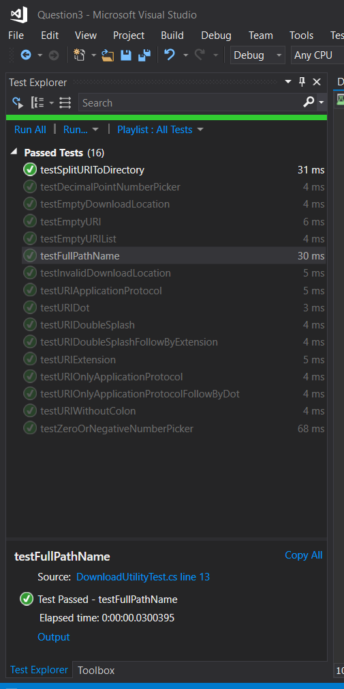
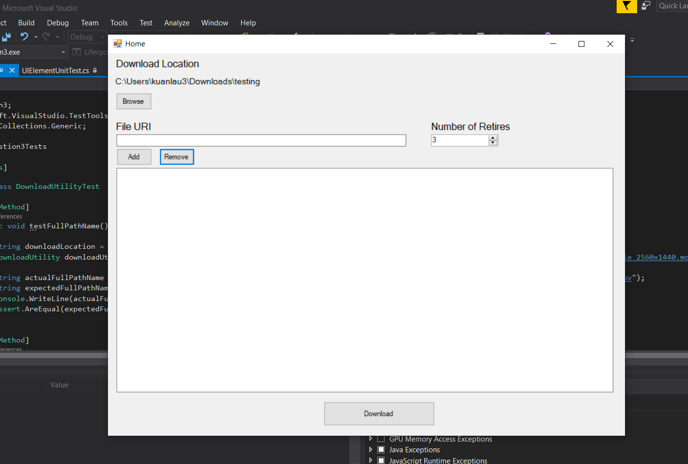
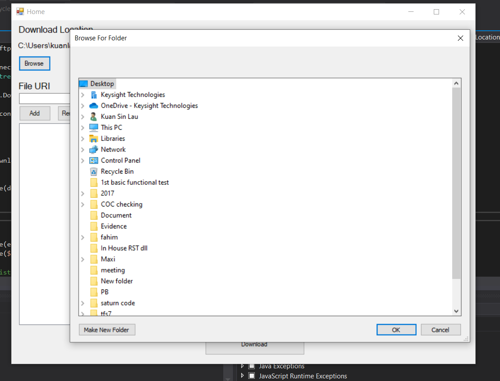
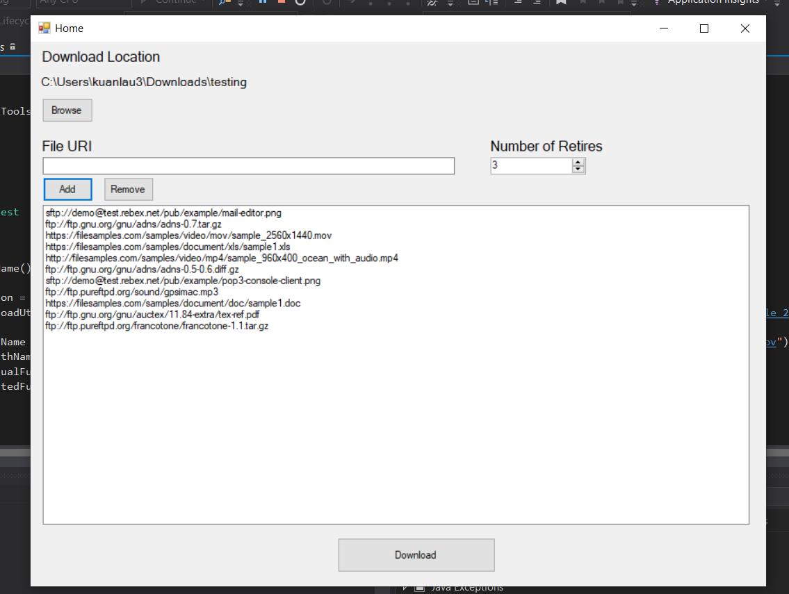
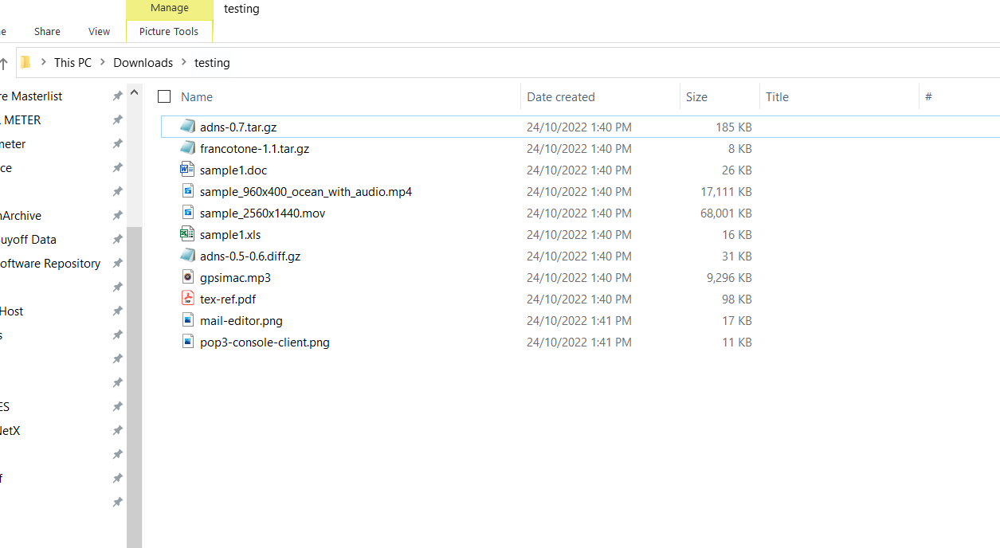
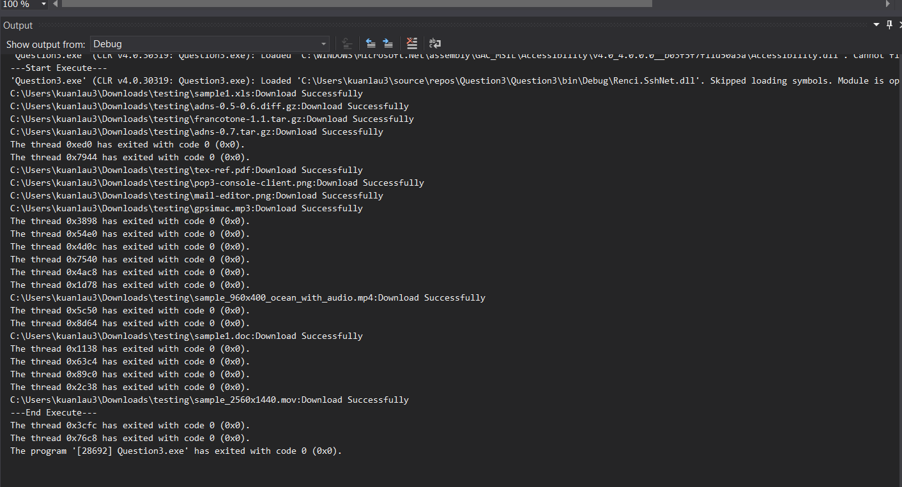
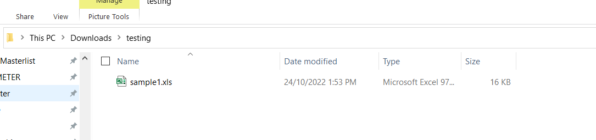
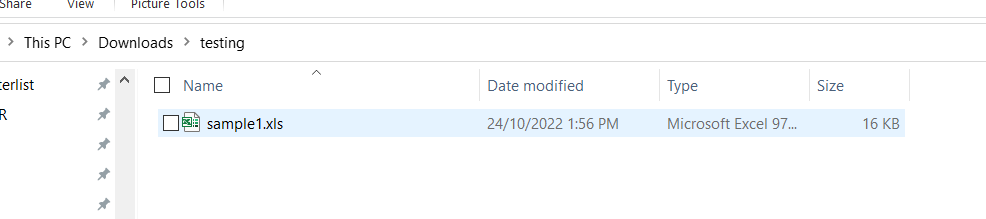

# Question3
<h2> Demo</h2>
You may download (https://tleapps.com) and try at your local PC.

<h2> Screenshot</h2>
<h3> Unit Test Result</h3>

<h3>Home Page</h3>

<h3>Able to browse download location</h3>

<h3>Able to add multiple URI</h3>

<h3>File download</h3>

<h3>Console</h3>

<h3>Overwrite same source file</h3>

<h3>No Wifi connection (Download failure)</h3>

