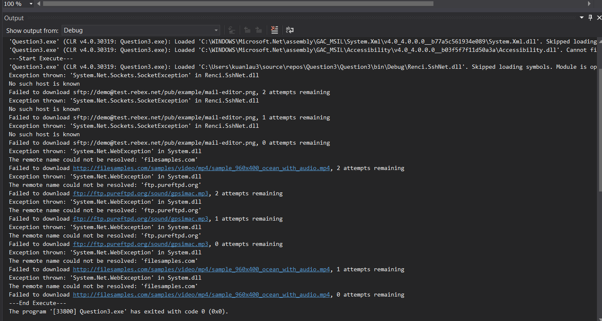

# Question3
<h2> Demo</h2>
You may download the source file and run this (https://github.com/laukuansin/Question3/blob/96e7dec47ca28f39428dcf6266e876c41ea3f916/Question3/Question3/bin/Debug/Question3.exe) at your local PC.
<h2>Sample URI</h2>
<ul>
  <li>sftp://demo@test.rebex.net/pub/example/mail-editor.png</li>
  <li>ftp://ftp.gnu.org/gnu/adns/adns-0.7.tar.gz</li>
  <li>sftp://demo@test.rebex.net/pub/example/mail-editor.png</li>
  <li>https://filesamples.com/samples/document/xls/sample1.xls</li>
  <li>http://filesamples.com/samples/video/mp4/sample_960x400_ocean_with_audio.mp4</li>
  <li>sftp://demo@test.rebex.net/pub/example/pop3-console-client.png</li>
  <li>ftp://ftp.pureftpd.org/sound/gpsimac.mp3</li>
  <li>https://filesamples.com/samples/document/doc/sample1.doc</li>
  <li>ftp://ftp.gnu.org/gnu/auctex/11.84-extra/tex-ref.pdf</li>
  <li>ftp://ftp.pureftpd.org/francotone/francotone-1.1.tar.gz</li>
</ul>

<h2> Screenshot</h2>
<h3> Unit Test Result</h3>

<h3>Home Page</h3>

<h3>Able to browse download location</h3>

<h3>Able to add multiple URI</h3>

<h3>File download</h3>

<h3>Console</h3>

<h3>Overwrite same source file</h3>

<h3>No Wifi connection (Download failure)</h3>

